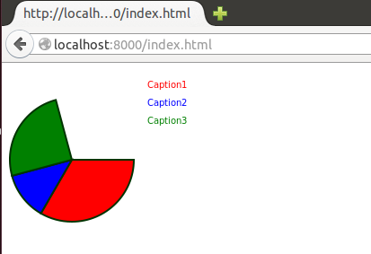

polymer-elements
================

My playground for custom polymer elements.

Created a pie-chart after attending an event in SF

To use it, assuming you have polymer and bower already installed.

Impor the platorm and the custom element to a html page:

<link rel="import" href="simple-pie-chart/simple-pie-chart.html">

Add the element to your page and give it some JSON to render the pie:

<simple-pie-chart size="200" lineWidth="2" slices='[{"caption": "Caption1", "color": "red", "slice": 120}, 
                                                      {"caption": "Caption2", "color": "#0000ff", "slice": 45},
                                                      {"caption": "Caption3", "color": "green", "slice": 0.25}]'>
                                                      
                                                      
The slice value can be either degrees (0 <slice <= 360) or percentage (0 < slice <= 1.0)
The element use radians internally but I figured percetages or degrees are preferred.

